<div align="center">


# Daftarche · دفترچه

**A self-hosted personal finance dashboard for tracking income, expenses, and who owes whom.**
Persian (RTL) interface · Jalali (Shamsi) calendar · Docker-ready

[](https://laravel.com)
[](https://livewire.laravel.com)
[](https://tailwindcss.com)
[](https://alpinejs.dev)
[](#option-1--docker-recommended)
[](LICENSE)
[](https://t.me/MREpicaler)

[فارسی](README.fa.md) · [Features](#features) · [Screenshots](#screenshots) · [Installation](#installation) · [Configuration](#configuration)

<br>

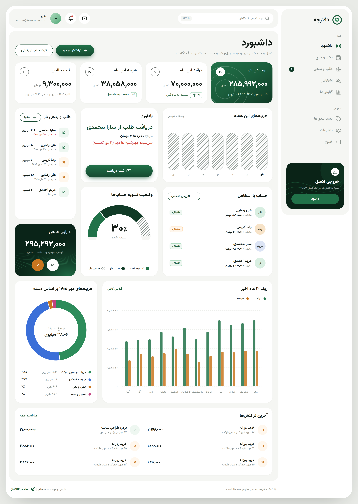

</div>

---

## Features

**Dashboard**
- Total balance, this month's income and expenses (with change vs. last month) and net receivables at a glance
- Daily spending for the current week (Saturday → Friday)
- Due-date reminder for the closest receivable or payable, with a one-click payment button
- Settlement gauge showing how much of all debts has been paid off
- Net worth (balance + receivables − payables)
- 12-month income vs. expense chart and an expense-by-category breakdown

**Income & expenses**
- Record, edit and delete transactions with title, category, Jalali date and notes
- Filter by Jalali month, type and category, plus full-text search
- Custom categories with a colour-blind-safe palette

**Debts & receivables**
- Track money you lent (receivables) and money you borrowed (payables), per person
- Due dates, partial payments, one-click "settle in full", and full payment history
- People are created automatically the first time you type a new name
- Per-person page with the net balance between you and that person

**Reports & data**
- Yearly report: monthly table, income/expense charts, category breakdowns, largest expenses
- Excel-friendly CSV export (UTF-8 with BOM) for transactions and debts

**Experience**
- Right-to-left Persian UI with the Vazirmatn typeface and Persian digits
- Jalali date picker, Persian validation messages, and amount input with live thousand separators
- Responsive down to mobile, with bottom-sheet forms and an off-canvas menu
- Login with rate limiting; single-user by design

## Screenshots

### Dashboard components

| | |
|:---:|:---:|
| 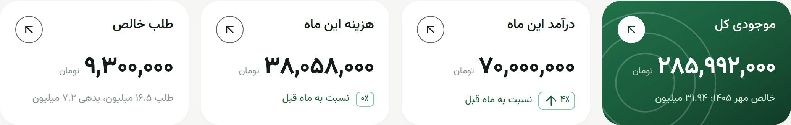 | 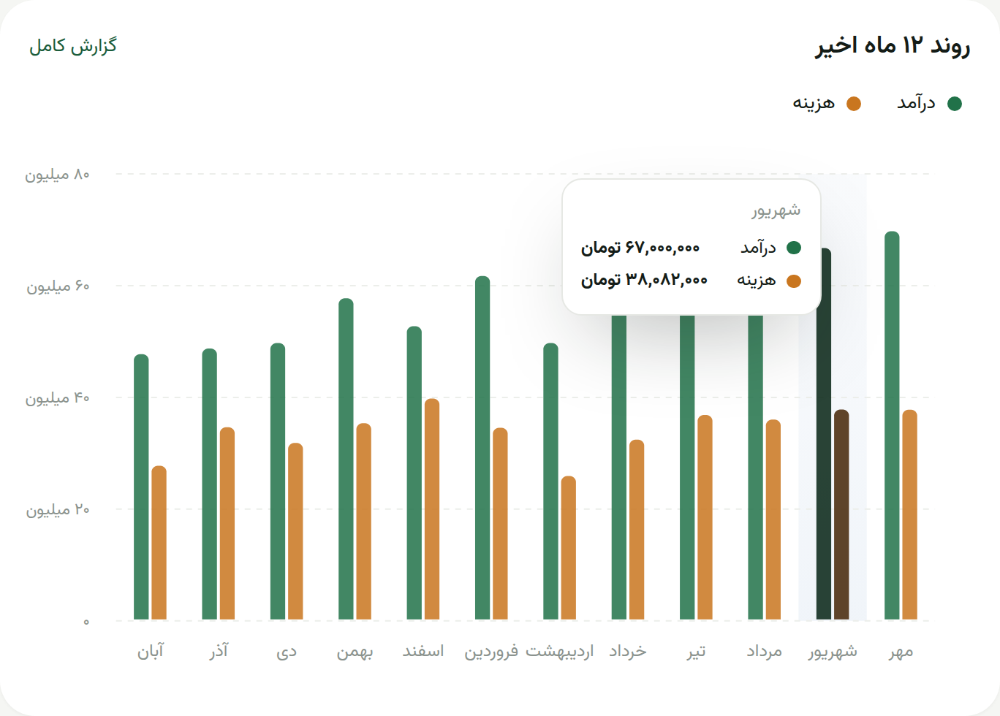 |
| KPI cards | 12-month trend with RTL tooltip |
| 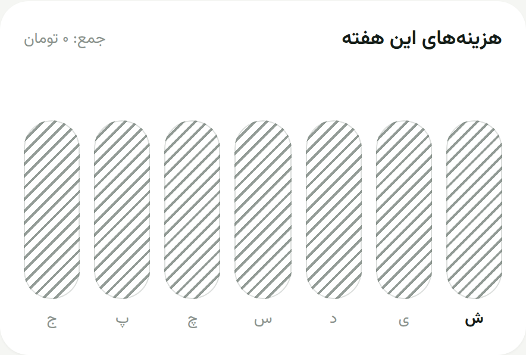 | 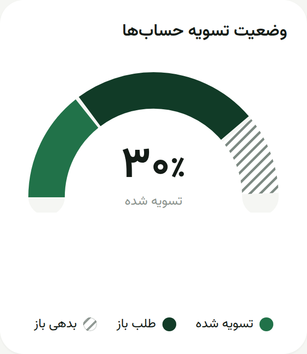 |
| Weekly spending | Settlement gauge |
| 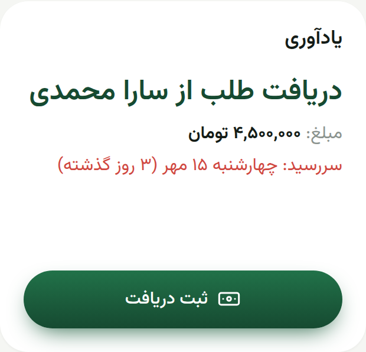 | 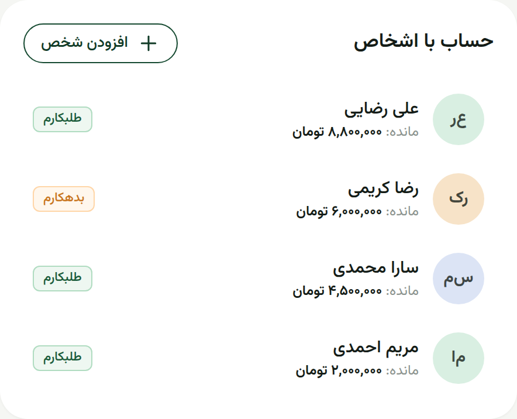 |
| Due-date reminder | Balances with people |

<p align="center">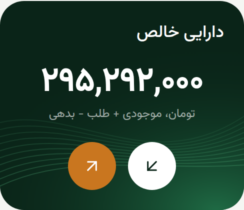</p>

### Pages

| | |
|:---:|:---:|
| 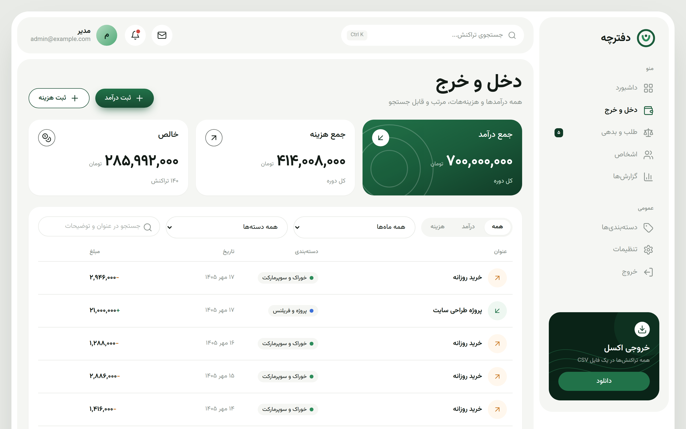 | 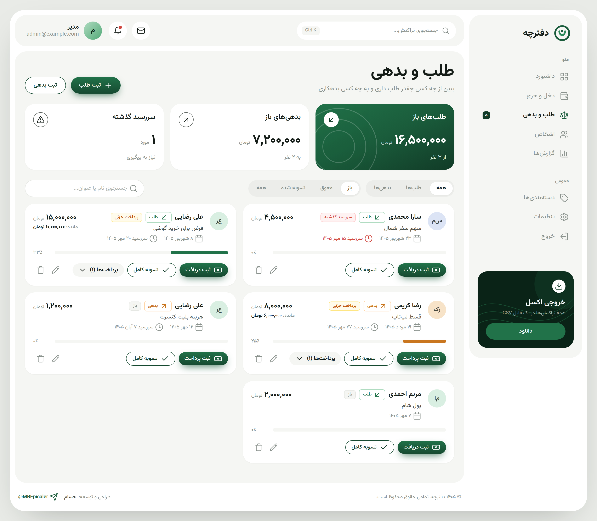 |
| Income & expenses | Debts & receivables |
| 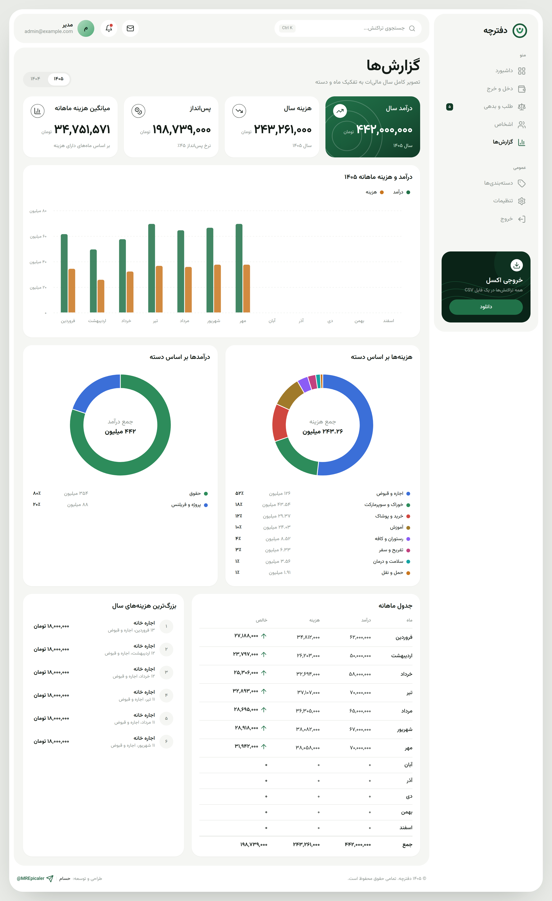 | 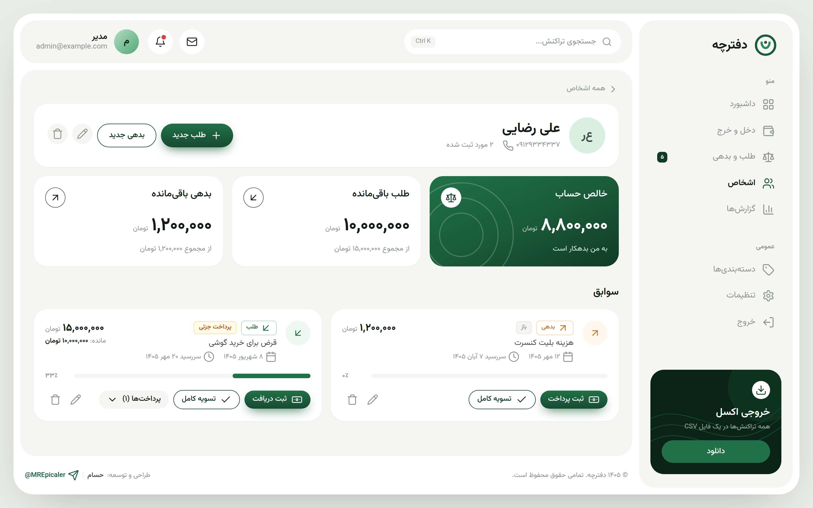 |
| Yearly reports | Person detail |
| 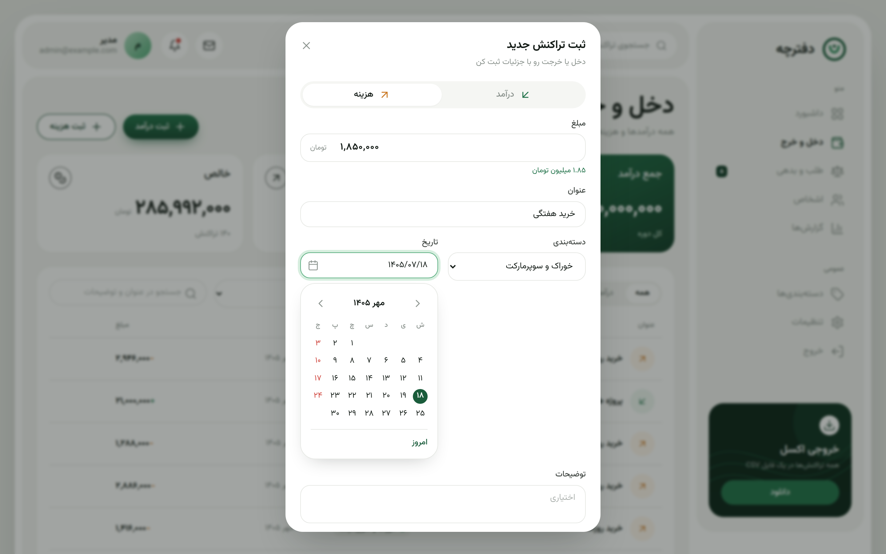 | 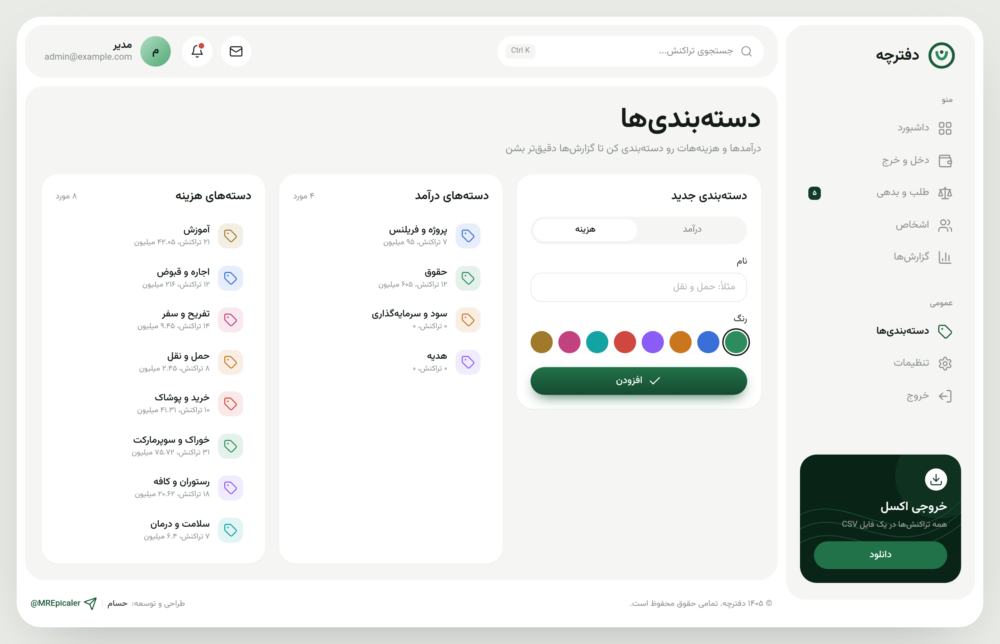 |
| Transaction form with Jalali date picker | Categories |

### Mobile

<p align="center">
  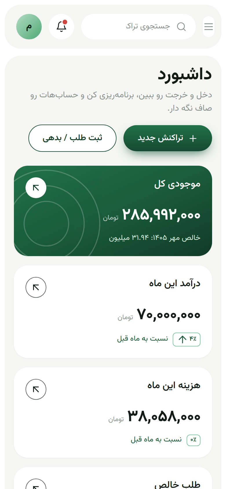
  &nbsp;
  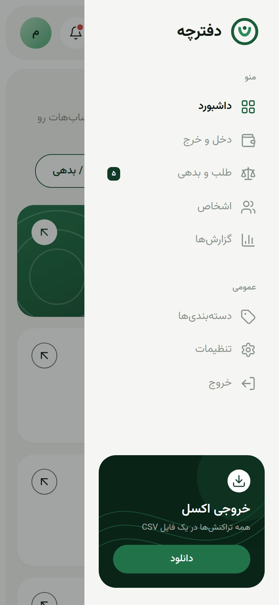
  &nbsp;
  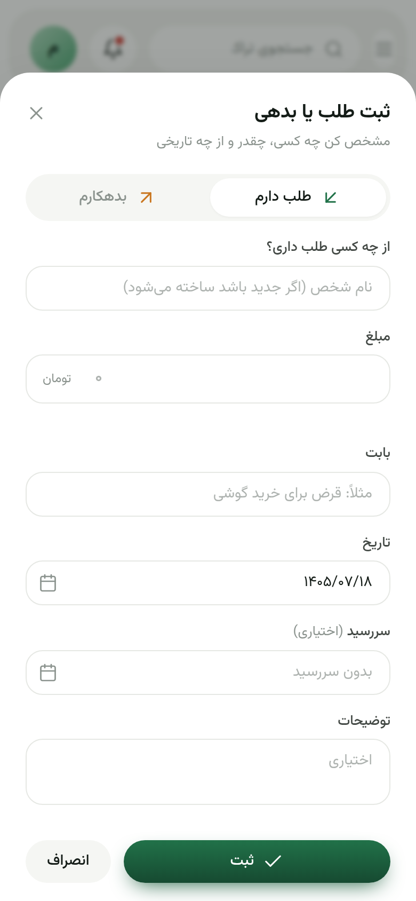
</p>

## Tech stack

| Layer | Technology |
|---|---|
| Backend | PHP 8.3+, Laravel 13 |
| UI | Livewire 4, Alpine.js, Tailwind CSS 4, ApexCharts |
| Build | Vite 8 |
| Database | MariaDB / MySQL, or SQLite |
| Dates | `morilog/jalali` (PHP), `jalaali-js` (browser) |
| Runtime | Docker Compose: PHP-FPM, Nginx, Node (Vite), MariaDB |

---

## Installation

Choose one of the two options below. **Docker is the easiest**: you only need Docker installed.

### Option 1 — Docker (recommended)

**Requirements:** [Docker](https://docs.docker.com/get-docker/) with Docker Compose v2 (Docker Desktop on Windows/macOS, or Docker Engine on Linux).

1. **Clone the repository**

   ```bash
   git clone https://github.com/Epicaler/daftarche.git
   cd daftarche
   ```

2. **Create your environment file**

   ```bash
   cp .env.example .env
   ```

   Open `.env` and review at least:

   | Variable | Why |
   |---|---|
   | `ADMIN_EMAIL`, `ADMIN_PASSWORD` | Your login. The user is created on first start. |
   | `DB_PASSWORD`, `DB_ROOT_PASSWORD` | Change from the defaults. |
   | `UID`, `GID` | **Linux only:** set to the output of `id -u` and `id -g` so files created by the containers belong to you. |
   | `APP_PORT`, `VITE_PORT` | Change if `8080` / `5180` are already in use. |

3. **Start everything**

   ```bash
   docker compose up -d
   ```

   The first start takes a few minutes. It builds the PHP image, runs `composer install` and `npm ci`, generates `APP_KEY` into `.env`, and runs the database migrations. You can follow the progress with:

   ```bash
   docker compose logs -f app node
   ```

4. **Open the app** at <http://localhost:8080> and sign in with `ADMIN_EMAIL` / `ADMIN_PASSWORD` (default: `admin@example.com` / `password`). Change the password afterwards in **تنظیمات** (Settings).

#### How the Docker setup works

| Service | Role |
|---|---|
| `app` | PHP 8.4-FPM. On every start it migrates and seeds the database (idempotently). |
| `web` | Nginx, serving on `APP_PORT` (default `8080`). |
| `node` | Builds the assets once, then runs the Vite dev server on `VITE_PORT` (hot reload). |
| `db` | MariaDB 10.11. |

- **Your code is never baked into an image.** The project folder is bind-mounted into the containers, so PHP and Blade changes apply on refresh and CSS/JS changes hot-reload, with no rebuild needed.
- **Your data stays on disk** in `docker/data/mariadb`. Neither `docker compose down` nor `down -v` deletes it; only removing that folder does.

#### Everyday commands

| Task | Command |
|---|---|
| Start / stop | `docker compose up -d` / `docker compose down` |
| Load sample data | `docker compose exec app php artisan db:seed --class=DemoSeeder` |
| Back up the database | `docker compose exec db sh -c 'mariadb-dump -u"$MARIADB_USER" -p"$MARIADB_PASSWORD" "$MARIADB_DATABASE"' > backup.sql` |
| Restore a backup | `docker compose exec -T db sh -c 'mariadb -u"$MARIADB_USER" -p"$MARIADB_PASSWORD" "$MARIADB_DATABASE"' < backup.sql` |
| Run artisan / composer | `docker compose exec app php artisan …` / `docker compose exec -u www-data app composer …` |
| Run the tests | `docker compose exec -u www-data app php artisan test` |
| View logs | `docker compose logs -f app` |

### Option 2 — Without Docker (PHP, Composer & Node on your machine)

**Requirements**

- PHP **8.3+** with the `pdo_mysql` or `pdo_sqlite`, `mbstring`, `xml` and `zip` extensions (Laravel defaults)
- [Composer](https://getcomposer.org) 2
- [Node.js](https://nodejs.org) **20.19+ or 22.12+** and npm
- **MySQL 8 / MariaDB 10.6+**, or nothing extra if you use **SQLite**

> Tip: [Laravel Herd](https://herd.laravel.com) (Windows/macOS) or [php.new](https://php.new) installs PHP, Composer and Node in one step.

1. **Clone and install dependencies**

   ```bash
   git clone https://github.com/Epicaler/daftarche.git
   cd daftarche
   composer install
   npm install
   ```

2. **Create the environment file and an application key**

   ```bash
   cp .env.example .env
   php artisan key:generate
   ```

3. **Configure the database** in `.env`. Pick one:

   **SQLite** (simplest, a single file):

   ```dotenv
   DB_CONNECTION=sqlite
   # DB_HOST, DB_PORT, DB_DATABASE, DB_USERNAME and DB_PASSWORD can be removed
   ```

   ```bash
   touch database/database.sqlite
   ```

   **MySQL / MariaDB:** create an empty database first, then:

   ```dotenv
   DB_CONNECTION=mariadb      # or mysql
   DB_HOST=127.0.0.1
   DB_PORT=3306
   DB_DATABASE=daftarche
   DB_USERNAME=your_user
   DB_PASSWORD=your_password
   ```

   Also set `APP_URL=http://localhost:8000` and your `ADMIN_EMAIL` / `ADMIN_PASSWORD`.

4. **Create the tables and your user**

   ```bash
   php artisan migrate --seed
   ```

5. **Build the front-end and start the server**

   ```bash
   npm run build
   php artisan serve
   ```

   Open <http://localhost:8000>. While developing, run `npm run dev` in a second terminal to get hot reload instead of rebuilding.

### Deploying to a server

Put the project behind Nginx/Apache with the document root pointing at `public/`, then:

```bash
composer install --no-dev --optimize-autoloader
npm ci && npm run build
php artisan migrate --force --seed
php artisan optimize
```

In `.env` set `APP_ENV=production`, `APP_DEBUG=false`, and an `https://` `APP_URL`. Make `storage/` and `bootstrap/cache/` writable by the web server.

---

## Configuration

| Variable | Default | Description |
|---|---|---|
| `APP_NAME` | `دفترچه` | Name shown in the sidebar and page titles |
| `APP_CURRENCY` | `تومان` | Currency label next to amounts |
| `APP_TIMEZONE` | `Asia/Tehran` | Timezone used for "today", weeks and months |
| `ADMIN_NAME` / `ADMIN_EMAIL` / `ADMIN_PASSWORD` | `مدیر` / `admin@example.com` / `password` | First user, created only if no user exists yet |
| `APP_PORT` | `8080` | Docker: port for the web server |
| `VITE_PORT` | `5180` | Port for the Vite dev server |
| `UID` / `GID` | `1000` | Docker: the user/group the containers run as |

## Testing

```bash
php artisan test
```

The tests always run on an in-memory SQLite database. As a safeguard, they refuse to start if they would touch any other database.

## Author

Designed and developed by **Hesam**.

- Telegram: [@MREpicaler](https://t.me/MREpicaler)
- GitHub: [@Epicaler](https://github.com/Epicaler)

Questions, ideas, or bug reports are welcome on Telegram or as a GitHub issue.

## License

Released under the [MIT License](LICENSE).

---

<p align="center">© 2026 Hesam · <a href="https://t.me/MREpicaler">@MREpicaler</a> · All rights reserved.</p>
